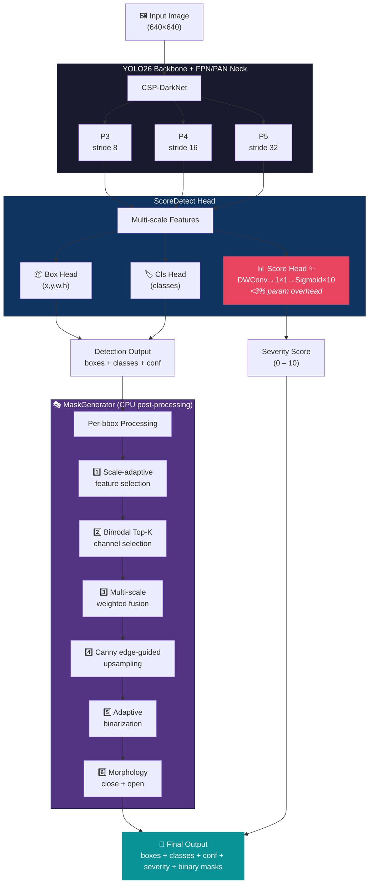
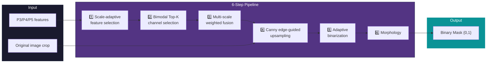

<div align="center">

# 🔬 SevSeg-YOLO

### Unified Detection, Severity Scoring & Zero-Annotation Segmentation
### for Industrial Defects

<br>

<a href="https://python.org"></a>
<a href="https://pytorch.org"></a>
<a href="LICENSE"></a>
<a href="CHANGELOG.md"></a>

<br><br>

> One model · Three tasks · Single forward pass · No mask annotations needed

<br>

**[📖 中文文档](README_zh.md)**&ensp;|&ensp;English

</div>

<br>

---

<br>

## 💡 The Problem

On a high-speed inspection line scanning **60+ products/min**, every defect needs three answers:

<table>
<tr><td>❓</td><td><b>Is there a defect?</b></td><td>→ Solved by standard YOLO detectors</td></tr>
<tr><td>📊</td><td><b>How severe?</b> (grade 2 = accept, grade 8 = scrap)</td><td>→ Needs a separate classifier + extra latency</td></tr>
<tr><td>📐</td><td><b>What area does it cover?</b> (ISO/GB compliance)</td><td>→ Needs pixel-level annotation (10–20× cost)</td></tr>
</table>

**SevSeg-YOLO answers all three in one model, one pass.**

<br>

---

<br>

## ✨ Key Innovations

<table>
<tr>
<td width="70" align="center">🧪</td>
<td>
<b>Gaussian NLL Loss</b><br>
Models the ±1 subjectivity of human inspectors as observation noise.<br>
<b>MAE ↓21.2%</b> &nbsp;·&nbsp; <b>Spearman ρ ↑54.3%</b> vs Smooth L1 (5-seed avg)
</td>
</tr>
<tr>
<td align="center">🎭</td>
<td>
<b>MaskGenerator (Zero-Annotation)</b><br>
Derives pixel-level masks from FPN features via bimodal channel selection + Canny-guided upsampling.<br>
<b>100% mask validity</b> &nbsp;·&nbsp; <b>1.13ms</b> median on CPU
</td>
</tr>
<tr>
<td align="center">⚡</td>
<td>
<b>Real-Time Deployment</b><br>
All 5 scales end-to-end <b>&lt;10ms</b> on TRT FP16 (<b>&gt;100 FPS</b>).<br>
Nano scale: <b>534 FPS</b> pure inference &nbsp;·&nbsp; Engine size <b>7.4MB</b>
</td>
</tr>
</table>

<br>

---

<br>

## 🏗️ Architecture



<br>

---

<br>

## 🚀 Quick Start

### Installation

```bash
git clone https://github.com/sevseg-yolo/sevseg-yolo.git
cd sevseg-yolo
pip install -e .
```

> Only standard `opencv-python` needed — no `opencv-contrib`.
> For ONNX export: `pip install -e ".[export]"` · For TensorRT: `pip install -e ".[tensorrt]"`

<br>

### Inference in 3 Lines

```python
from sevseg_yolo import SevSegYOLO

model = SevSegYOLO("best.pt")
result = model.predict("image.jpg")

for det in result.detections:
    print(f"{det.class_name}: severity={det.severity:.1f}, mask_fill={det.fill_ratio:.3f}")
```

<br>

---

<br>

## 📖 Full Tutorial

### Step 1 · Prepare Dataset

<details>
<summary><b>1.1  Annotate with LabelMe</b> — click to expand</summary>
<br>

Use [LabelMe](https://github.com/wkentaro/labelme) to draw rectangle bounding boxes. Write severity in the `description` field:

```json
{
  "shapes": [{
    "label": "scratch",
    "points": [[120, 80], [250, 180]],
    "shape_type": "rectangle",
    "description": "severity=7.5"
  }]
}
```

**Scoring guideline:**

| Severity | Meaning | Action |
|:---:|:---|:---|
| 0 | No defect | — |
| 1 – 3 | Minor | Accept |
| 4 – 6 | Moderate | Rework |
| 7 – 10 | Severe | Scrap |

</details>

<details>
<summary><b>1.2  Organize directories</b></summary>
<br>

```
my_dataset/
├── images/
│   ├── img_001.jpg
│   └── ...
└── jsons/
    ├── img_001.json
    └── ...
```

</details>

<details>
<summary><b>1.3  Convert to YOLO format</b></summary>
<br>

```python
from sevseg_yolo.convert import convert_dataset

convert_dataset(
    images_dir="my_dataset/images",
    jsons_dir="my_dataset/jsons",
    output_dir="my_dataset_yolo",
    val_ratio=0.2,
)
```

Output: standard YOLO layout with 6-column labels (`class_id cx cy w h severity`)

</details>

<br>

### Step 2 · Train

```python
from ultralytics import YOLO

model = YOLO("ultralytics/cfg/models/26/yolo26m-score.yaml")
model.train(
    task="score_detect",
    data="my_dataset_yolo/data.yaml",
    pretrained="yolo26m.pt",
    epochs=105, batch=32, imgsz=640,
    mixup=0.0,   # ⚠️ MUST be 0
)
```

> ⚠️ **MixUp must be 0.** Severity scores cannot be interpolated between mixed images.

<br>

### Step 3 · Inference

<details>
<summary><b>Python API</b> (recommended)</summary>
<br>

```python
from sevseg_yolo import SevSegYOLO

model = SevSegYOLO("runs/score_detect/train/weights/best.pt")
result = model.predict("test.jpg")

for det in result.detections:
    print(f"Class: {det.class_name}, Severity: {det.severity:.1f}/10")
    print(f"  Bbox: {det.bbox}, Mask: {det.mask.shape}, Fill: {det.fill_ratio:.3f}")

result.visualize().save("output.jpg")
```

</details>

<details>
<summary><b>CLI</b></summary>
<br>

```bash
python tools/predict_demo.py --weights best.pt --source test_images/ --save-dir outputs/
```

</details>

<br>

### Step 4 · Export & Deploy

<details>
<summary><b>ONNX + TensorRT</b></summary>
<br>

```python
from sevseg_yolo.export import export_scoreyolo_onnx
from sevseg_yolo.tensorrt_deploy import deploy_scoreyolo

export_scoreyolo_onnx(model.model, "model.onnx", imgsz=640, opset=17)
deploy_scoreyolo("model.onnx", "model.engine", fp16=True, max_batch=4)
```

</details>

<br>

### Step 5 · Evaluate

```python
from sevseg_yolo.evaluation import full_score_evaluation

metrics = full_score_evaluation(pred_scores, gt_scores)
# → MAE, Spearman ρ, ±1 tolerance accuracy, per-class MAE, confusion matrix
```

<br>

---

<br>

## 🎭 MaskGenerator

A **pure post-processing module** — no training, runs on CPU. Converts implicit defect knowledge in FPN features into explicit binary masks.



**Why bimodal?** Channels with high spatial variance might capture background texture. Bimodal selection picks channels where the bbox contains two distinct brightness populations — directly measuring defect-vs-normal separation.

<br>

---

<br>

## 📊 Model Zoo

| Scale | Params | mAP@50 | Score MAE ↓ | Spearman ρ ↑ |
|:---:|:---:|:---:|:---:|:---:|
| **n** | 2.57M | 0.513 | 1.317 | 0.742 |
| **s** | 10.19M | 0.573 | 1.306 | 0.720 |
| **m** | 22.19M | 0.608 | 1.316 | 0.715 |
| **l** | 26.59M | 0.626 | 1.297 | 0.709 |
| **x** | 56.08M | 0.623 | 1.224 | 0.744 |

<sub>5-seed averages · Gaussian NLL σ=0.1, λ=0.05</sub>

<br>

---

<br>

## 📁 Project Structure

```
sevseg-yolo/
├── sevseg_yolo/              # Core package
│   ├── model.py              # Unified inference
│   ├── mask_generator_v3.py  # Bimodal selection (default)
│   ├── mask_generator_v2.py  # Variance selection (legacy)
│   ├── convert.py            # Data converter
│   ├── evaluation.py         # Metrics
│   ├── export.py             # ONNX export
│   ├── tensorrt_deploy.py    # TensorRT
│   └── visualization.py      # Plots
├── ultralytics/              # Modified Ultralytics
│   ├── nn/modules/head.py    # ScoreHead + ScoreDetect
│   ├── utils/loss.py         # Gaussian NLL loss
│   └── cfg/models/26/        # Model configs
├── configs/                  # Training templates
├── tools/                    # CLI scripts
└── pyproject.toml
```

<br>

## ⚠️ Notes

| | |
|:---|:---|
| **MixUp = 0** | Mandatory for severity training |
| **Severity** | 0.0 – 10.0 (normalized to 0–1 internally) |
| **MaskGenerator** | Approximate masks, not pixel-perfect |
| **σ = 0.1** | From ±1 annotation noise |
| **opencv-contrib** | Not needed |

<br>

## 📖 Citation

```bibtex
@article{sevseg_yolo_2026,
  title  = {SevSeg-YOLO: A Unified Detection, Severity Scoring, and
            Annotation-Free Approximate Segmentation Framework for Industrial Defects},
  author = {SevSeg-YOLO Contributors},
  year   = {2026}
}
```

## 📜 License

[AGPL-3.0](LICENSE) · Modified Ultralytics code retains its original AGPL-3.0 license.

## 🙏 Acknowledgements

[Ultralytics](https://github.com/ultralytics/ultralytics) · [LabelMe](https://github.com/wkentaro/labelme)
