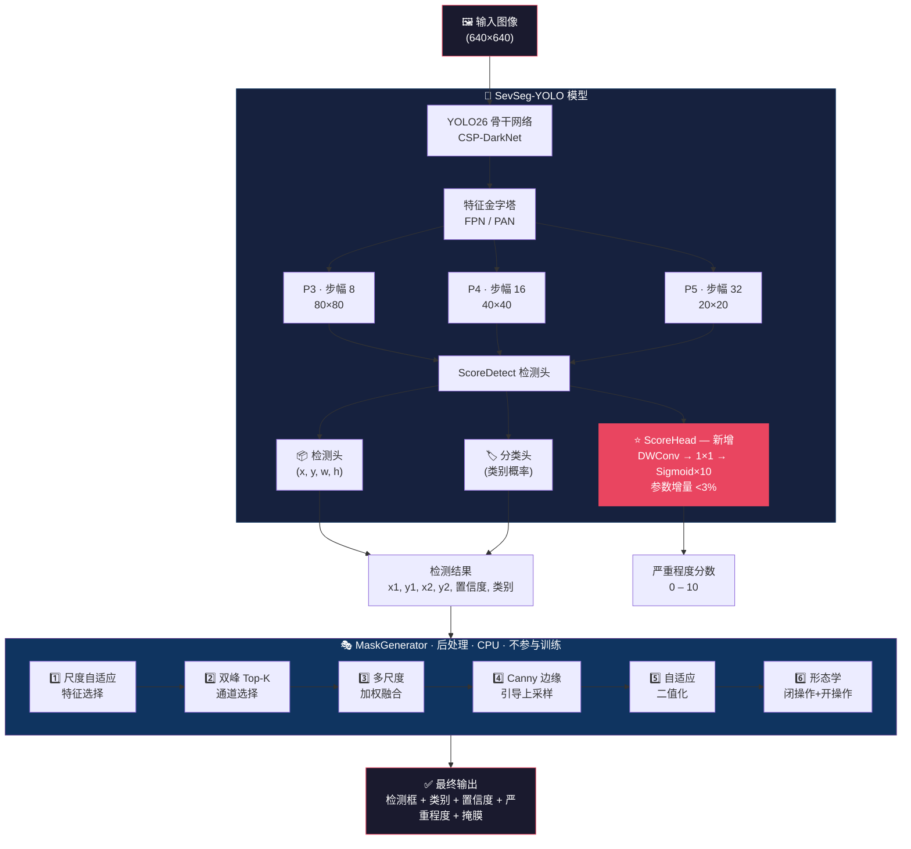
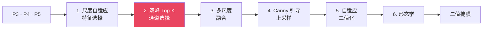

<div align="center">

<br>

<picture>
  <source media="(prefers-color-scheme: dark)" srcset="https://img.shields.io/badge/%F0%9F%94%AC_SevSeg--YOLO-%E6%A3%80%E6%B5%8B_%C2%B7_%E8%AF%84%E5%88%86_%C2%B7_%E5%88%86%E5%89%B2-blue?style=for-the-badge&labelColor=0d1117">
  
</picture>

<br><br>

### 面向工业缺陷的统一检测、严重程度评分

### 与零标注近似分割框架

<br>

<a href="README.md"></a>

<br><br>


<br><br>

> **一个模型**在单次前向传播中同时输出检测框、**[0,10] 连续严重程度分数**和近似**轮廓掩膜**——**无需任何掩膜标注**。

<br>

</div>

---

<br>

## 🌟 项目简介

<table>
<tr>
<td>

**问题背景** — 工业检测对每个缺陷需要回答三个问题：在哪？（检测）、多严重？（评分）、多大面积？（分割）。传统方案需要级联 3 个独立模型，掩膜标注成本是检测的 10–20 倍，且累积推理延迟。

**我们的方案** — SevSeg-YOLO 用一个模型、一次推理同时回答全部三个问题：

</td>
</tr>
</table>

<br>

<div align="center">

| | 传统方案 | SevSeg-YOLO |
|:---|:---:|:---:|
| 🔍 **缺陷检测** | ✅ YOLO 检测器 | ✅ 内置 |
| 📊 **严重程度评分** | ❌ 需要额外分类器 | ✅ ScoreHead (0–10) |
| 🎭 **缺陷掩膜** | ❌ 需要像素标注 (10–20×成本) | ✅ 零标注生成 |
| ⚡ **推理次数** | 2–3 次级联 | **1 次** |
| 🕐 **端到端延迟** | >20ms | **<10ms** (全规模) |

</div>

<br>

---

<br>

## 🏗️ 架构

<br>



<br>

### 🧪 高斯 NLL 损失

标准回归损失假设标注无噪声，但检测员对同一缺陷的评分偏差约 ±1 分。高斯 NLL 将噪声显式建模：

$$L_{score} = \frac{1}{2\sigma^2}(y_{pred} - y_{gt})^2 + \ln\sigma$$

**效果**：相比 Smooth L1，MAE ↓21.2%，Spearman ρ ↑54.3%（5-seed 统计）。

<br>

---

<br>

## 🚀 快速开始

```bash
git clone https://github.com/sevseg-yolo/sevseg-yolo.git
cd sevseg-yolo
pip install -e .
```

```python
from sevseg_yolo import SevSegYOLO

model = SevSegYOLO("best.pt")
result = model.predict("image.jpg")

for det in result.detections:
    print(f"{det.class_name}: 严重程度={det.severity:.1f}, 掩膜填充率={det.fill_ratio:.3f}")
```

<br>

---

<br>

## 📖 完整使用教程

<br>

### 第一步 · 标注数据

使用 [LabelMe](https://github.com/wkentaro/labelme) 画矩形框标注缺陷，在 `description` 字段写入严重程度分数：

```json
{
  "shapes": [{
    "label": "scratch",
    "points": [[120, 80], [250, 180]],
    "shape_type": "rectangle",
    "description": "severity=7.5"
  }]
}
```

<details>
<summary><b>💡 严重程度评分参考</b></summary>

| 范围 | 含义 | 处置 |
|:---:|:---|:---|
| **0** | 无缺陷 | — |
| **1 – 3** | 轻微缺陷 | 接受 |
| **4 – 6** | 中等缺陷 | 返工 |
| **7 – 10** | 严重缺陷 | 报废 |

请根据实际质量标准调整阈值。

</details>

<br>

### 第二步 · 格式转换

```python
from sevseg_yolo.convert import convert_dataset

convert_dataset(
    images_dir="my_dataset/images",
    jsons_dir="my_dataset/jsons",
    output_dir="my_dataset_yolo",
    val_ratio=0.2,   # 80% 训练集, 20% 验证集
)
```

<details>
<summary><b>📂 输出目录结构与标签格式</b></summary>

```
my_dataset_yolo/
├── images/{train,val}/
├── labels/{train,val}/    ← "类别ID cx cy w h 严重程度"
└── data.yaml              ← 自动生成
```

</details>

<br>

### 第三步 · 训练

```python
from ultralytics import YOLO

# 选择规模: n(最快) / s / m(推荐) / l / x(最精确)
model = YOLO("ultralytics/cfg/models/26/yolo26m-score.yaml")
model.train(
    task="score_detect",
    data="my_dataset_yolo/data.yaml",
    pretrained="yolo26m.pt",
    epochs=105, batch=32, imgsz=640,
    mixup=0.0,    # ⚠️ 必须为 0
)
```

<details>
<summary><b>💡 训练建议</b></summary>

- 先用 `n` 规模快速验证流程，再换大模型
- 使用 `configs/train_score.yaml` 作为模板
- ScoreHead 从零训练，骨干网络加载预训练权重
- 训练时关注 `score_loss`，应随 `box_loss` 和 `cls_loss` 一起下降
- **为什么 MixUp=0？** "严重裂纹×0.3 + 轻微划痕×0.7 = 5.2" 没有物理意义

</details>

<br>

### 第四步 · 推理

```python
from sevseg_yolo import SevSegYOLO

model = SevSegYOLO("best.pt")
result = model.predict("test.jpg")

for det in result.detections:
    print(f"类别: {det.class_name}")
    print(f"  严重程度: {det.severity:.1f} / 10")
    print(f"  置信度: {det.confidence:.2f}")
    print(f"  检测框: {det.bbox}")
    print(f"  Mask: {det.mask.shape}, 填充率={det.fill_ratio:.3f}")

# 可视化保存
result.visualize().save("output.jpg")
```

```bash
python tools/predict_demo.py --weights best.pt --source images/ --save-dir outputs/
```

<br>

### 第五步 · 导出部署

```python
from sevseg_yolo.export import export_scoreyolo_onnx
from sevseg_yolo.tensorrt_deploy import deploy_scoreyolo

export_scoreyolo_onnx(model.model, "model.onnx", imgsz=640)          # → ONNX
deploy_scoreyolo("model.onnx", "model.engine", fp16=True)            # → TensorRT
```

<br>

### 第六步 · 评估

```python
from sevseg_yolo.evaluation import full_score_evaluation

metrics = full_score_evaluation(pred_scores, gt_scores)
# → MAE, Spearman ρ, ±1 容忍准确率, 分类别 MAE
```

<br>

---

<br>

## 🎭 MaskGenerator 原理

**纯后处理模块**——不参与训练，在 CPU 上运行。利用检测模型自身的 FPN 特征图推导像素级缺陷掩膜。

**核心思路**：骨干网络在检测训练中已经学会了区分缺陷与正常区域——MaskGenerator 将这种隐式知识转化为显式二值掩膜。



<details>
<summary><b>双峰通道选择原理（V3 核心改进）</b></summary>

在 bbox 区域内，对每个特征通道：

1. 排序所有像素值
2. 计算**最暗 30%** 的均值（代表缺陷区域）
3. 计算**最亮 30%** 的均值（代表正常区域）
4. **双峰间距** = 亮均值 − 暗均值
5. 选双峰间距**最大**的 Top-K 通道

这些通道最能区分缺陷和正常区域。比 V2 的方差选择更好——方差高的通道可能只是背景纹理变化大。

</details>

<br>

---

<br>

## 📊 模型库

| 规模 | 参数 | GFLOPs | mAP@50 | 评分 MAE ↓ | Spearman ρ ↑ |
|:---:|:---:|:---:|:---:|:---:|:---:|
| **n** | 2.57M | 5.3 | 0.513 | 1.317 | 0.742 |
| **s** | 10.19M | 20.8 | 0.573 | 1.306 | 0.720 |
| **m** | 22.19M | 68.5 | 0.608 | 1.316 | 0.715 |
| **l** | 26.59M | 86.8 | 0.626 | 1.297 | 0.709 |
| **x** | 56.08M | 194.8 | 0.623 | 1.224 | 0.744 |

<sub>5-seed 统计 · Gaussian NLL (σ=0.1, λ=0.05) · 全规模 TRT FP16 端到端 < 10ms (>100 FPS)</sub>

<br>

---

<br>

## 📁 项目结构

```
sevseg-yolo/
├── 📦 sevseg_yolo/              # 核心包
│   ├── model.py                 #   统一推理入口
│   ├── mask_generator_v3.py     #   双峰通道选择（默认）
│   ├── mask_generator_v2.py     #   方差通道选择（旧版）
│   ├── convert.py               #   数据格式转换
│   ├── evaluation.py            #   评估指标
│   ├── export.py                #   ONNX 导出
│   ├── tensorrt_deploy.py       #   TensorRT 部署
│   └── visualization.py         #   可视化工具
├── 🔧 ultralytics/              # 修改的 YOLO26
│   ├── nn/modules/head.py       #   ScoreHead
│   ├── utils/loss.py            #   高斯 NLL 损失
│   └── cfg/models/26/           #   模型配置
├── 📋 configs/                  # 训练配置模板
├── 🛠️ tools/                    # 命令行演示脚本
└── 📄 LICENSE, CHANGELOG.md, CONTRIBUTING.md
```

<br>

---

<br>

## ⚠️ 注意事项

> ⛔ **MixUp = 0** — 严重程度训练必须关闭

> 📏 **Severity 范围** — 0.0 到 10.0（训练时内部归一化到 0–1）

> 🎭 **掩膜精度** — 从特征图推导的近似掩膜，非像素级精确分割

> 📦 **依赖** — 只需标准 `opencv-python`，无需 opencv-contrib

<br>

---

<div align="center">

## 📖 引用

</div>

```bibtex
@article{sevseg_yolo_2026,
  title   = {SevSeg-YOLO: A Unified Detection, Severity Scoring, and
             Annotation-Free Approximate Segmentation Framework
             for Industrial Defects},
  author  = {SevSeg-YOLO Contributors},
  year    = {2026}
}
```

<div align="center">

**[AGPL-3.0 许可证](LICENSE)** · 基于 [Ultralytics](https://github.com/ultralytics/ultralytics) 和 [LabelMe](https://github.com/wkentaro/labelme)

</div>
